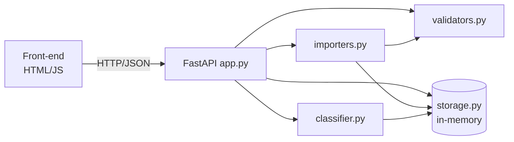

# 🎧 Homework 2: Intelligent Customer Support System

> **Student Name**: Adewale (Wale) Adetiba
> **Date Submitted**: 2026-09-21
> **AI Tools Used**: Claude (Cowork), Claude Code

---

## 📋 Project Overview

A customer-support ticket management system with a REST API, rule-based
auto-classification, a comprehensive test suite (**98% coverage**), multi-level
documentation, and a plain HTML/JS front-end. Tickets can be imported in bulk
from **CSV, JSON, and XML**. Storage is in-memory (no database), and FastAPI
serves interactive Swagger docs at `/docs`.

### ✅ Features

- **Ticket CRUD API** — create, list (with filters), read, update, delete.
- **Multi-format bulk import** — CSV, JSON, XML with a per-row success/failure summary.
- **Auto-classification** — rule-based category + priority detection with a
  confidence score, reasoning, and matched keywords; optional auto-run on
  creation, manual override, and a decision log.
- **Validation** — email format, subject/description length, enum checks,
  structured `{ error, details[] }` responses.
- **Test suite** — 67 tests across API, model, import (CSV/JSON/XML),
  classification, integration, and performance; 98% coverage.
- **Front-end** — list/filter, create/edit with client-side validation, detail
  view, bulk import, and one-click classify.

### 🏗️ Architecture



### 🧰 Tech Stack

Python 3.9+, FastAPI, Uvicorn, pytest + pytest-cov. Front-end is dependency-free
HTML/CSS/JavaScript.

### 📁 Structure

```
homework-2/
├── src/
│   ├── app.py           # FastAPI routes
│   ├── models.py        # Ticket dataclass + Pydantic request models + enums
│   ├── validators.py    # validation rules
│   ├── classifier.py    # rule-based auto-classification
│   ├── importers.py     # CSV / JSON / XML parsing + bulk import
│   └── storage.py       # in-memory store + classification log
├── tests/               # 67 tests, 98% coverage
├── frontend/index.html  # single-file UI
├── demo/                # sample_tickets.csv/json/xml + invalid files
├── scripts/             # sample-data generator
├── docs/
│   ├── API_REFERENCE.md
│   ├── ARCHITECTURE.md
│   ├── TESTING_GUIDE.md
│   └── screenshots/
├── requirements.txt
└── HOWTORUN.md
```

## ▶️ Quick start

```bash
python3 -m venv .venv && source .venv/bin/activate
pip install -r requirements.txt
cd src && uvicorn app:app --host 0.0.0.0 --port 8000 --reload
```

Open **http://localhost:8000/docs** for the API, and open
`frontend/index.html` in a browser for the UI. See `HOWTORUN.md` for details.

## 🧪 Running tests

```bash
source .venv/bin/activate
python -m pytest --cov=src --cov-report=term-missing
```

<div align="center">

*This project was completed as part of the AI-Assisted Development course.*

</div>
