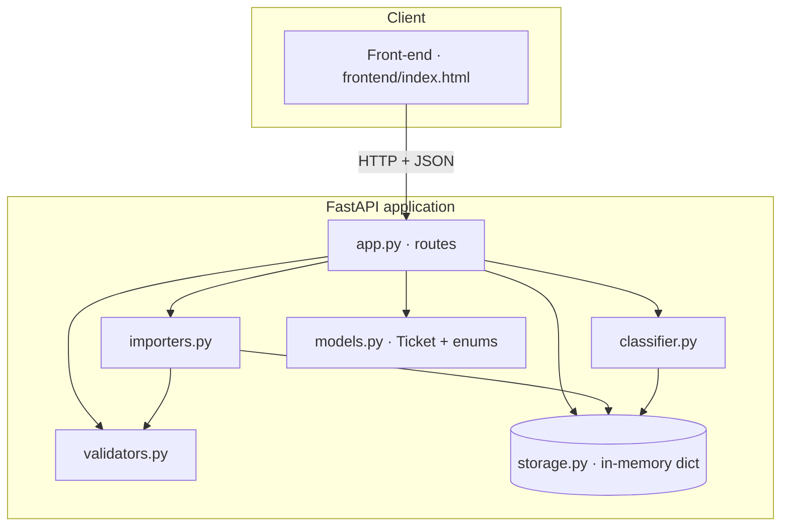
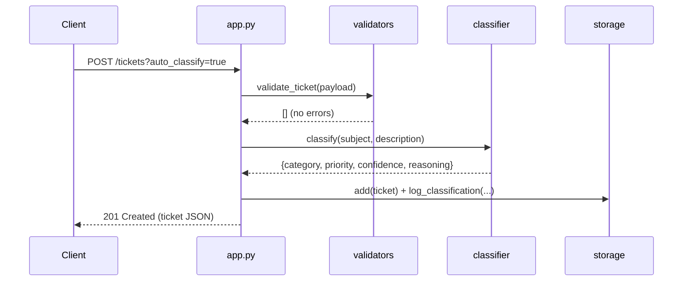
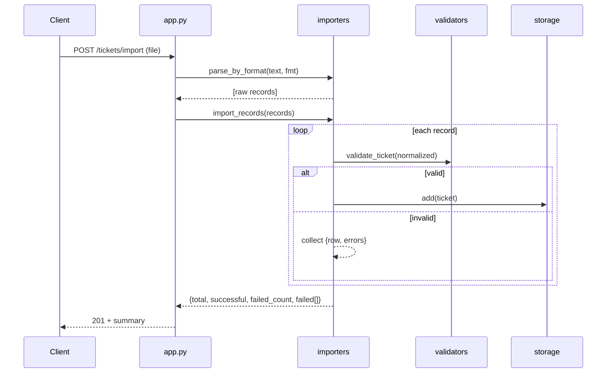

# 🏛️ Architecture

## Overview

The system is a single FastAPI application with clean module boundaries and an
in-memory store. There is no database — data lives in process memory for the
life of the server, which keeps the project focused on the API, import, and
classification logic.

## Components

| Module | Responsibility |
|--------|----------------|
| `app.py` | HTTP routing, request/response shaping, error contract, CORS |
| `models.py` | `Ticket` dataclass, Pydantic request models, enum value sets |
| `validators.py` | Field-level validation returning structured error details |
| `classifier.py` | Deterministic keyword-based category + priority scoring |
| `importers.py` | Parse CSV/JSON/XML → normalize → validate → create; bulk summary |
| `storage.py` | In-memory ticket store, filtering, balance of state, decision log |

## Data flow — creating a ticket with auto-classify

## Data flow — bulk import

## Design decisions & trade-offs

- **In-memory storage.** Simplest fit for the assignment; trade-off is no
  persistence across restarts. The `storage` module isolates this so a real
  datastore could replace it without touching routes.
- **Manual validation over Pydantic auto-422.** Gives an exact, uniform
  `{ error, details[] }` contract across create, update, and import. A
  `RequestValidationError` handler maps structural errors into the same shape.
- **Rule-based classifier (no LLM).** Deterministic and fully testable; keyword
  banks are easy to extend. Trade-off: less nuance than an ML model, mitigated
  by confidence scoring and manual override.
- **Import normalization layer.** CSV (flat columns), JSON (nested), and XML
  (elements) all normalize to one payload shape before validation, so the
  validator and creation path are shared across formats.
- **Separation of concerns.** Routing, rules, classification, import, and
  storage are independent modules, which is what keeps coverage high and tests
  small.

## Security & performance considerations

- Input is validated and length-bounded; enums are whitelisted.
- Uploads are decoded as UTF-8 and parsed defensively (malformed files → 400).
- CORS is open (`*`) for local development; a real deployment would restrict it.
- All lookups are dict/list operations; performance tests assert bulk create,
  import, and listing stay within generous time budgets.
