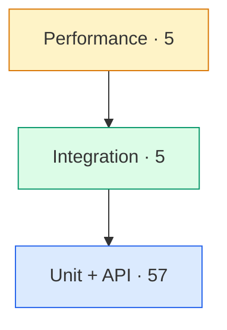

# 🧪 Testing Guide

## Test pyramid



The suite is broad at the base (unit + API tests) and narrows toward
integration and performance — 67 tests in total, **98% line coverage**.

## Running the tests

```bash
source .venv/bin/activate
python -m pytest --cov=src --cov-report=term-missing      # coverage in terminal
python -m pytest --cov=src --cov-report=html              # docs/screenshots source
```

## Test files

| File | Focus | Count |
|------|-------|-------|
| `test_ticket_model.py` | Validation rules | 10 |
| `test_ticket_api.py` | CRUD + list/filter endpoints | 11 |
| `test_import_csv.py` | CSV parsing + import | 6 |
| `test_import_json.py` | JSON parsing + import | 5 |
| `test_import_xml.py` | XML parsing + import | 5 |
| `test_categorization.py` | Classifier rules | 10 |
| `test_classification_api.py` | Classification via API | 6 |
| `test_import_errors.py` | Malformed files + metadata merge | 4 |
| `test_integration.py` | Lifecycle, bulk import, concurrency, filters | 5 |
| `test_performance.py` | Throughput / latency benchmarks | 5 |

## Sample & fixture data

Sample import files live in `demo/`:
`sample_tickets.csv` (50), `sample_tickets.json` (20), `sample_tickets.xml` (30),
plus `invalid_tickets.csv` and `invalid_tickets.json` for negative tests.

## Manual testing checklist

- [ ] Create a ticket via `/docs` → 201 with generated id + timestamps
- [ ] Create with an invalid email → 400 with `details`
- [ ] Import each of CSV / JSON / XML → summary counts correct
- [ ] Import a malformed file → 400, no partial crash
- [ ] Filter list by category + priority together
- [ ] Auto-classify a ticket → category/priority/confidence set
- [ ] Update status to `resolved` → `resolved_at` populated
- [ ] Delete a ticket → subsequent GET returns 404

## Performance benchmarks (asserted budgets)

| Scenario | Budget |
|----------|--------|
| Create 100 tickets | < 5.0 s |
| Import 50-row CSV | < 2.0 s |
| List 100 tickets | < 1.0 s |
| 200 classify calls | < 1.0 s |
| Get one by id | < 0.2 s |
